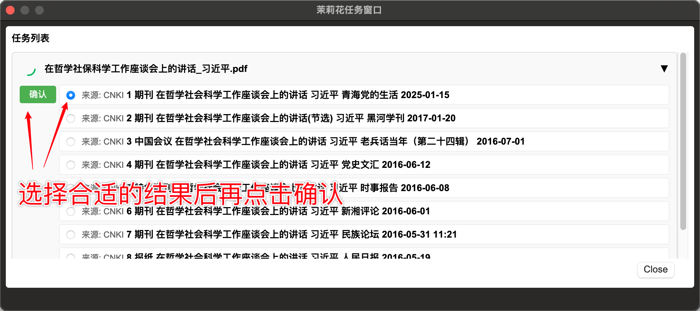
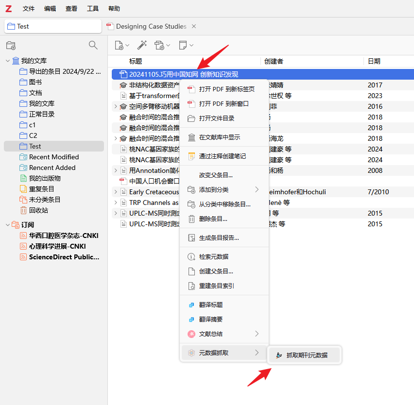

# 茉莉花 Jasminum

 

简体中文 | [English](doc/README-en.md)

## 1. 基础功能

- 中文PDF元数据抓取
- 中文转换器下载，转换器来源于 Zotero中文社区 [translators_CN](https://github.com/l0o0/translators_CN)
- 中文引用格式下载，引用格式来源于项目 Zotero中文社区 [styles](https://github.com/zotero-chinese/styles)
- 小工具
  - 语言设置
  - 中文姓名折合与合并

## 2.使用教程

### 2.1 元数据抓取

目前支持仅支持从**中国知网**获取元数据，后续考虑会添加其他数据来源。

在 Zotero 中添加中文附件后，右键附件，在菜单栏选择`茉莉花抓取` -> `抓取期刊元数据`，在弹出窗口可以看到元数据抓取的结果。
如果有多个搜索结果，需要你手动选择最匹配的结果，再点击确认，即可完成抓取。

### 2.3 本地附件匹配功能

在使用 Zotero Connector 在浏览器上抓取中文期刊时（尤其是中国知网），经常出现元数据抓取成功而附件无法下载自动的异常，当你手动下载期刊附件（PDF/CAJ）后，可以方便地用此功能来将下载的附件与元数据匹配。

右键期刊条目，`小工具` -> `在下载文件夹中查找附件`，该功能会自动在当前`下载目录`中寻找与当前条目匹配的附件，匹配规划是**根据期刊标题与文件名的匹配度**。

`下载目录`默认是系统的下载目录，Windows系统默认是`C:\Users\用户名\Downloads`，Mac系统默认是`/Users/用户名/Downloads`，Linux系统默认是`/home/用户名/Downloads`。也可以在`设置`中修改下载目录。

下载目录中匹配成功的附件默认会移动到备份目录中`下载目录/jasminum-backup`中，在设置中还可以选择

- 删除匹配成功的附件。匹配到元数据的附件已经保存到Zotero中，可以放心删除下载目录中的附件（个人建议删除，避免下载目录中附件过多）。
- 无须处理。即使匹配成功，附件还是会在下载目录中，当然Zotero已经保存了一份。

### 2.3 PDF大纲

在 PDF 阅读窗口的左侧边栏中，点击茉莉花书签按钮，即可看到书签大纲窗口。

最上方的5个按钮，功能分别是：

- 展开所有书签
- 折叠所有书签
- 添加书签
- 删除书签
- 将书签内容保存到PDF（默认只以配置文件的形式保存到本地）

**键盘快捷键导航**

- 键盘↑，上一个书签（跳过折叠内容）
- 键盘↓，下一个书签（跳过折叠内容）
- 键盘←或→，展开或折叠节点
- 空格键，编辑书签内容
- [，将书签移到上一级（作为原上级节点的下一个相邻节点）
- ]，将书签移到下一级（自动将相邻的上一个节点作为上级节点）
- \，创建新节点（默认作为选中节点的子节点）
- Delete 或 Backspace，删除节点

## 3. ❤️致谢

特别感谢[jiaojiaodubai](https://github.com/jiaojiaodubai)同学，长期以来对[translators_CN](https://github.com/l0o0/translators_CN) 和 本项目 的贡献。
