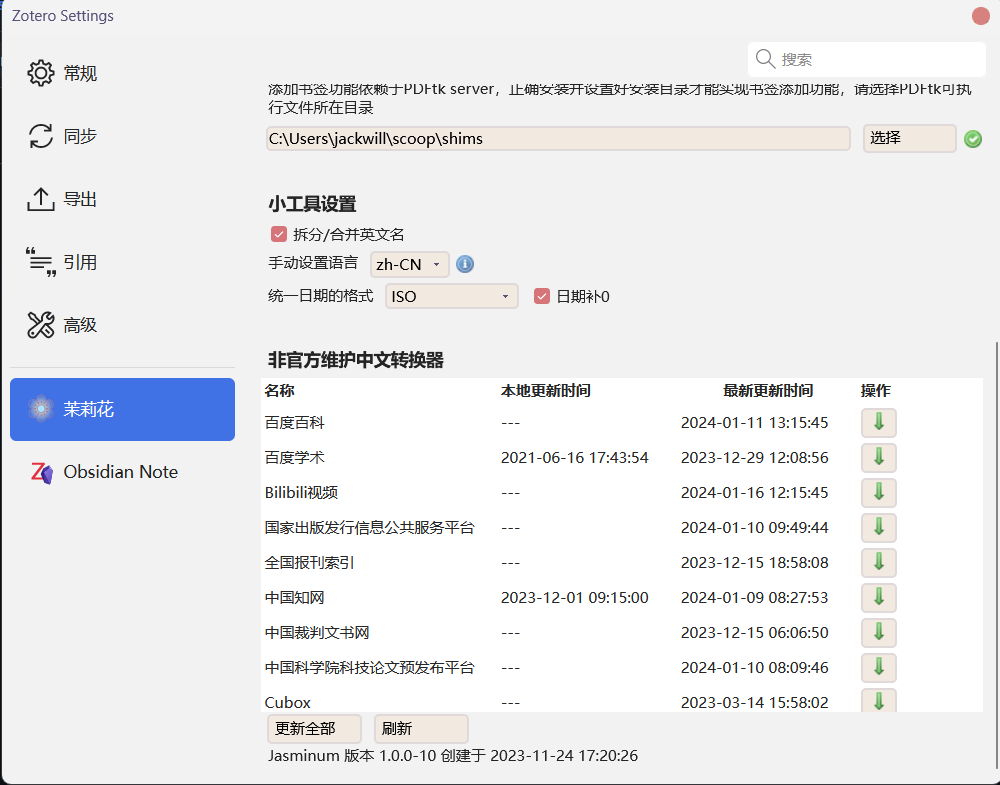
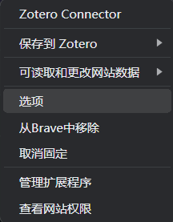
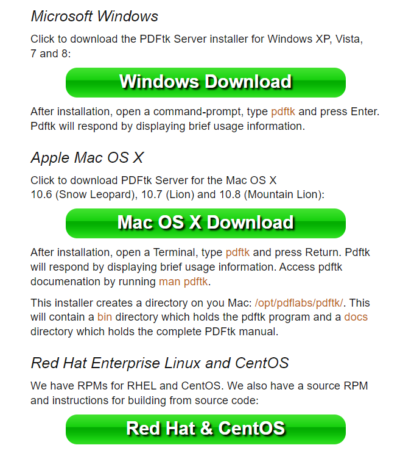

[](https://github.com/windingwind/zotero-plugin-template)
[](https://github.com/l0o0/jasminum/releases)

[](https://github.com/l0o0/jasminum/blob/master/LICENSE)


# 茉莉花（jasminum）For Zotero

一个简单的 Zotero 中文插件，旨在提升 Zotero 中文用户的使用体验。主要功能有：

1. 中文期刊附件（PDF/CAJ）的元数据抓取，支持添加PDF/CAJ时自动抓取元数据功能
2. 集成 Zotero 中文社区转换器的下载与更新功能
3. 为知网学位论文PDF添加章节书签（依赖于PDFtk）
4. 更新中文文献引用次数，核心期刊信息
5. 合并/拆分姓，名，识别文献条目语言，下载知网附件，统一日期格式等

## 1 安装
下载最新的[xpi](https://github.com/l0o0/jasminum/releases/latest)文件（Firefox浏览器用户记住右键另存为），打开 Zotero -> 工具 -> 插件 -> 右上小齿轮图标 -> Install Add-on From File ... -> 选择下载好的xpi文件。

## 2 使用说明

### 2.1 知网元数据识别
知网元数据识别功能可从**知网下载的PDF**或**知网保存的网页条目**抓取完整的元数据。如果识别失败，可以参考下方[常见问题](#faq-cnki-metadata)

右键 -> 知网助手 -> 抓取知网元数据

### 2.2 知网学位论文PDF添加书签
从知网上抓取学位论文的章节页码，用第三方软件PDFtk，将书签添加到PDF中。学位论文PDF必须先抓取元数据后，才可添加书签。

右键 -> 知网助手 -> 添加书签


### 2.3 更新知网引用数
已经抓取到完整元数据的条目，可以用些功能从知网抓取引用数，期刊类型等信息。这些信息会存储在`extra`其他字段中（自定义字段正在设计中）

### 2.4 查找知网附件功能
模拟浏览器从知网查询并下载PDF的流程，可以为附件缺失的条目自动下载PDF。不过因各学校网络环境不同，一般在学校内部使用校园网下载成功率较高。在设置页面可以选择下载CAJ或PDF

### 2.5 拆分姓名与合并姓名
将条目中作者信息按**姓**和**名**进行拆分与合并，防止在引用时姓与名分开。不过有些CSL文件已经优化了此问题，拆分还是合并已经没有影响 


### 2.6 手动设置语言 
先在茉莉花设置 - 小工具，添加需要手动设置的语言信息，**默认是zh-CN**。右键点击该功能后，可以条目语言栏中用设定值替换。

### 2.7 自动设置语言
在茉莉花设置 - 小工具，添加自动设置语言列表，使用`nlp.js`自动识别语言类别，并进行替换。相关设置在 茉莉花设置 - 小工具

### 2.8 Zotero 中文转换器（翻译器）更新

翻译器是 Zotero translator 的中文翻译。不过后面觉得这个翻译不好，有歧意。经常会有同学会认为和英文文献翻译相关，更有同学和 Zotero-PDF-Translate 插件搞混。现在统一定为转换器，将网页上的信息转换到Zotero条目上。


按需要查找对应网站的转换器，点击 Update 的按钮进行下载。Local 是本地转换器的更新时间，如果未下载会显示**---**。NewUpdate是 Zotero 中文社区中转换器仓库[translators_CN](https://github.com/l0o0/translators_CN)的更新时间。如果出现在右侧出现感叹号，则是说明转换器可以更新，如果是绿色对勾，说明是最新的，不必更新。

上面页面下载之后，还需要在浏览器右键 Zotero Connector ，选择Preference 或扩展选项

在 Zotero Connector 设置页面找到 Advanced - Update Translators ，点击该按钮（建议多次点击），手动更新转换器


🎯 使用**Mac Safari** 浏览器的同学，可以在Safari浏览器空白页面，右键 - Zotero Preference - Advanced - Update Translators。

可以参考[视频](https://www.bilibili.com/video/BV1F54y1k73n/)，或者B站上的其他教程。如果下载后 ，多次点击没有效果，建议试试其他浏览器，或隔几小时后再试试。

## 3 PDFtk安装

插件是调用 PDFtk server 提供的功能给PDF添加书签。所以使用该功能，需要提前下载安装好 PDFtk server，并在插件中设置好对应的目录，注意此处目录设置是**bin目录**。[PDFtk server 下载页面](https://www.pdflabs.com/tools/pdftk-server/)

### 3.1 Windows

1. 在 [下载页面](https://www.pdflabs.com/tools/pdftk-server/)找到上图的下载链接，下载Windows的安装文件。按默认设置安装后，设置目录为**C:\Program Files (x86)\PDFtk Server\bin**


2. 使用 [scoop](https://scoop.sh/) 安装
```{powershell}
scoop install pdftk

# C:\Users\Yourname\scoop\shims\pdftk.EXE
```

### 3.2 Linux
以经典的 Ubuntu 16.04 为例，安装`pdftk`
```bash
sudo apt install pdftk
which pdftk
# /usr/bin/pdftk
```


### 3.3 Mac

感谢下面同学的测试与反馈
[@GuokaiLiu](https://github.com/GuokaiLiu)， [issue](https://github.com/l0o0/jasminum/issues/7#issuecomment-706448964)
[@tsunho12](https://github.com/tsunho12)， [#135](https://github.com/l0o0/jasminum/issues/135)
[@simon2413](https://github.com/simon2413)， [#55](https://github.com/l0o0/jasminum/issues/55)

#### 3.3.1 Intel MacOS(>10.15)
由于官方未更新PDFtk server最新版本的链接，通过官网首页下载的PDFtk server (2021.10.26)仍不支持部分较新的mac系统，目前推荐通过：https://www.pdflabs.com/tools/pdftk-the-pdf-toolkit/pdftk_server-2.02-mac_osx-10.11-setup.pkg 下载。

#### 3.3.2 M 系列芯片
需要先[安装 M系列芯片 版本的 homebrew](https://zhuanlan.zhihu.com/p/372576355)，然后在终端 Terminal 中
```bash
brew install pdftk-java
# 如果上面命令安装失败或使用异常，使用下面这条命令安装
HOMEBREW_BOTTLE_DOMAIN= brew install pdftk-java
which pdftk  # 查看pdftk安装路径
```
如果安装错了 PDFtk，可能会出现下面的错误提示（如M1芯片安装了Intel版本）
```bash
pdftk --version 
# zsh: bad CPU type in executable: pdftk
```
#### 3.3.3 PDFtk 路径设置

Zotero 茉莉花插件配置`pdftk`路径：`/opt/pdflabs/pdftk/`或`/usr/local/bin/pdftk` （该路径默认对外隐藏无法选取，不同系统路径也会有差异，具体以`which pdftk`输出的结果为准）。
选择路径的技巧：`shift+command+G`: 输入：`/opt/pdflabs/pdftk/`（如此`which`显示是该目录），选择`bin`确认

> 官网：https://www.pdflabs.com/tools/pdftk-server/  
> <font color="red">After installation, open a Terminal, type pdftk and press Return. Pdftk will respond by displaying brief usage information(注意！安装后请试试这一步，出现使用说明说明安装成功)</font>. Access pdftk documenation by running man pdftk.

> This installer creates a directory on you Mac: /opt/pdflabs/pdftk/. This will contain a bin directory which holds the pdftk program and a docs directory which holds the complete PDFtk manual.


## 4 常见问题

1. <a id="faq-cnki-metadata"></a>CAJ/PDF 文件元数据抓取失败
一般按照默认设置是通过文件名来获取文献的标题与作者，在知网上按照标题与作者信息进行搜索。
默认文件名识别模板`{%t}_{%g}`，识别`文章标题_作者`命名的文件名，如`义务教育阶段体育课程评价的中国式现代化建设路径_程文广.pdf`
`{%t}`，识别`文章标题`命名文件，如`义务教育阶段体育课程评价的中国式现代化建设路径.pdf`
如果信息抓取失败，可以尝试将文件名的作者信息去掉，同时在设置中将文件名模板修改为`{%t}`，此时程序会将文件名识别为标题，并利用该标题在知网上进行模糊搜索，成功率比较高 

2. 非官方翻译器页面空白
刚点开该窗口时，页面信息为空白，需要手动点击下方的刷新按钮，拉取最新的翻译器信息

3. Zotero 使用卡顿
如果电脑其他软件运行正常，可能是 Zotero 插件安装过多，可适当禁用一些插件。

4. 转换器更新之后还是没有效果？
在浏览器中更新转换器，有时候花费很多时间还是没效果。建议换个浏览器，或者手动下载PDF后，拖到 Zotero，右键PDF - 知网助手 - 抓取知网元数据😄
