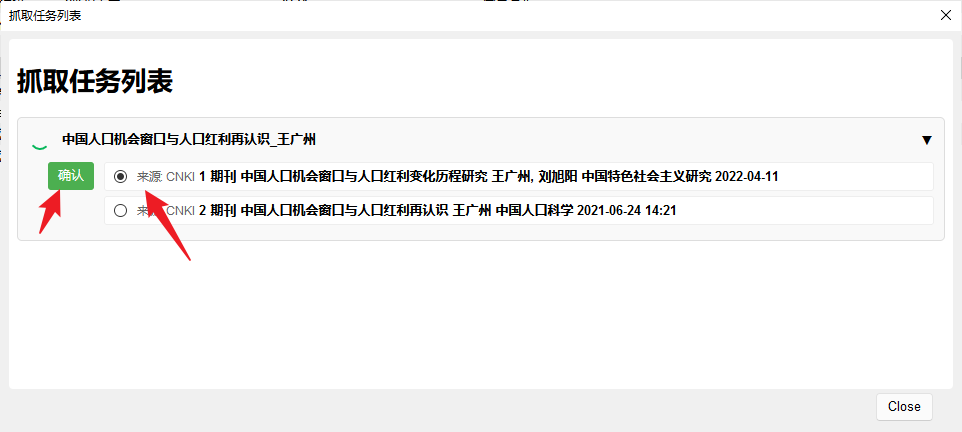

# Jasminum - 茉莉花

Zotero 中文用户插件。
A plugin for Zotero Chinese users.

[English](README.md) | [简体中文](./README-zh-CN.md)

[Zotero 6 版本](https://github.com/l0o0/jasminum/tree/master)

## 1. 主要功能

+ 元数据抓取，包括期刊及书籍，数据来源：知网
+ Zotero 中文社区转换器下载，依赖项目：[translators_CN](https://github.com/l0o0/translators_CN)
+ 其他小功能
  + 姓名拆分与合并

## 2. 使用说明
**2.1 元数据查询**

右键 PDF 附件，在弹窗菜单中，选择元数据抓取

抓取时，如果出现多个搜索结果，在进度窗口会等待用户进行选择，请选择合适的结果，并确认后会继续后面的数据扳。

## 致谢

